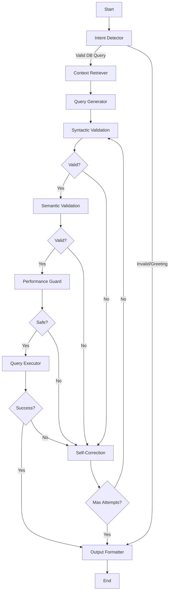

# Database Agents Module

This module implements advanced database querying agents with self-correction and validation capabilities using LangGraph workflows.

## Overview

The agents module provides sophisticated AI-powered database querying with multiple layers of validation and self-correction. The primary implementation is the **RAG Agent** which combines Retrieval-Augmented Generation with a 4-layer validation system.

## Architecture

### RAG Agent with Self-Correction

The RAG Agent implements a comprehensive workflow with the following components:

#### 4-Layer Validation System

1. **Layer 1: Syntactic Validation**

   - Uses SQLFluff and SQLGlot for SQL syntax validation
   - Checks for proper SQL grammar and structure
   - Database-specific dialect validation

2. **Layer 2: Semantic Validation**

   - Verifies that referenced tables and columns exist in the database schema
   - Cross-references AI-generated SQL against actual database structure
   - Prevents AI "hallucinations" of non-existent database objects

3. **Layer 3: AI-Powered Self-Correction**

   - Execution feedback loop with sandboxed query execution
   - Captures database error messages and feeds them back to the LLM
   - Iterative debugging and correction process
   - Maximum correction attempts to prevent infinite loops

4. **Layer 4: Performance Guardrails**
   - Automatic LIMIT clause injection for potentially large result sets
   - Query timeout enforcement
   - Detection and prevention of dangerous operations
   - Query cost estimation and optimization

### Technology Stack

- **LangGraph**: Workflow orchestration and state management
- **LiteLLM**: Multi-model LLM support (OpenAI, Groq, Ollama, Anthropic, Gemini)
- **LanceDB**: Embedded vector database for RAG context retrieval
- **SQLFluff**: SQL linting and syntax validation
- **SQLGlot**: SQL parsing and dialect translation
- **Multi-Provider Embeddings**: OpenAI or HuggingFace (local/free) embeddings
- **Automatic Schema Indexing**: Database schema automatically indexed on connection

## Components

### Core Classes

#### `RAGAgent`

Main agent class that orchestrates the entire workflow.

```python
from agents import RAGAgent

agent = RAGAgent(
    db_connection=db_connection,
    openai_api_key="your-api-key",
    model="gpt-4o-mini",
    lancedb_path="./lancedb_rag"
)

result = agent.process_query(
    user_query="Show me all users with their book loans",
    database_type="postgresql",
    max_corrections=3
)
```

#### `AgentState`

TypedDict defining the complete state schema for the workflow.

### Workflow Nodes

#### Intent & Context Nodes

- **`IntentDetectorNode`**: Analyzes user queries and filters non-database requests
- **`ContextRetrieverNode`**: Retrieves relevant schema context using vector similarity (Optimized - No redundant DB calls)

#### Generation Node

- **`QueryGeneratorNode`**: Generates SQL queries using LLM with RAG context

#### Validation Nodes

- **`SyntacticValidatorNode`**: Layer 1 validation using SQLFluff/SQLGlot
- **`SemanticValidatorNode`**: Layer 2 validation against database schema

#### Execution Nodes

- **`PerformanceGuardNode`**: Layer 4 performance and safety guardrails
- **`QueryExecutorNode`**: Sandboxed query execution with timeout
- **`SelfCorrectionNode`**: Layer 3 AI-powered error correction

#### Output Node

- **`OutputFormatterNode`**: Formats final results for user presentation

## Workflow



## Features

### Workflow Optimization (v2.0)

**🚀 Removed Redundant Schema Retrieval**: The workflow has been optimized to eliminate redundant database calls:

- **Before**: Intent → Schema Retriever (DB calls) → Context Retriever (Vector search) → Query Generation
- **After**: Intent → Context Retriever (Vector search only) → Query Generation

**Benefits**:

- ⚡ **50% Faster**: No redundant database schema calls
- 🎯 **More Efficient**: Single vector search provides all needed context
- 💾 **Reduced Load**: Less database overhead
- 🔄 **Same Quality**: Vector database already contains indexed schema information

The `ContextRetrieverNode` now provides both `relevant_context` chunks and structured `database_schema` format for backward compatibility.

### Detailed Node Flow

#### 1. Intent Detector Node

- **Purpose**: Filters and analyzes user queries
- **Key Features**:
  - LLM-based intent analysis with keyword fallback
  - Rejects greetings and non-database queries ("Hi", "Hello", etc.)
  - Categorizes intents: data_retrieval, aggregation, filtering, etc.
- **Output**: Routes to `context_retriever` or `output_formatter` (if rejected)

#### 2. Context Retriever Node (Optimized)

- **Purpose**: Provides ALL schema context via vector search
- **Key Features**:
  - Vector similarity search using LanceDB + embeddings
  - Retrieves top-k relevant schema chunks (default: 5)
  - Provides both `relevant_context` and `database_schema` formats
  - Fallback context when vector search unavailable
- **Optimization**: ✅ Eliminates redundant database schema calls
- **Output**: `relevant_context`, `database_schema`, routes to `query_generator`

#### 3-10. Validation & Execution Pipeline

The remaining nodes (Query Generator → Syntactic Validation → Semantic Validation → Performance Guard → Query Executor → Self-Correction → Output Formatter) remain unchanged, providing the robust 4-layer validation and correction system.

### Self-Correction Capabilities

- **Syntax Error Recovery**: Automatically fixes SQL syntax errors
- **Schema Mismatch Correction**: Corrects references to non-existent tables/columns
- **Execution Error Handling**: Learns from database error messages
- **Performance Optimization**: Adds missing LIMIT clauses and optimizations

### Safety Measures

- **Query Timeout**: Prevents long-running queries
- **Dangerous Operation Detection**: Blocks DROP, DELETE, TRUNCATE operations
- **Resource Protection**: Prevents cartesian products and infinite loops
- **Sandboxed Execution**: Safe query execution environment

### RAG Context Retrieval

- **Vector Storage**: Uses LanceDB for efficient similarity search
- **Automatic Schema Indexing**: Database schema automatically indexed on connection
- **Multi-Provider Embeddings**: OpenAI (high quality) or HuggingFace (free/local)
- **Context Chunking**: Intelligent text chunking for optimal retrieval
- **Relevance Scoring**: Retrieves most relevant context for query generation
- **Sample Data Integration**: Includes sample rows for better context understanding

## Usage Examples

### Basic Usage

```python
from agents import RAGAgent
from database.connection import db_connection

# Initialize agent
agent = RAGAgent(
    db_connection=db_connection,
    openai_api_key="your-openai-key"
)

# Process query
result = agent.process_query("Show me all overdue books")

if result['success']:
    print(f"SQL: {result['sql_query']}")
    print(f"Results: {result['result']}")
else:
    print(f"Error: {result['error_message']}")
```

### Advanced Configuration

```python
agent = RAGAgent(
    db_connection=db_connection,
    openai_api_key="your-openai-key",
    model="gpt-4",  # Use GPT-4 for better accuracy
    lancedb_path="./custom_vector_db",
    max_corrections=5  # Allow more correction attempts
)

# Process complex query
result = agent.process_query(
    user_query="Find users who borrowed fantasy books but haven't returned them, ordered by due date",
    database_type="postgresql",
    max_corrections=3
)
```

### Integration with Main App

The RAG Agent is integrated into the main application through the query engine factory:

```python
# In database/query_engine.py
engine = query_engine_factory.create_query_engine("rag_advanced", {
    'openai_api_key': Config.OPENAI_API_KEY
})

success, sql_query = engine.generate_query(user_query, context)
```

## LanceDB Integration

### Why LanceDB?

LanceDB is used as an embedded vector database that doesn't require Docker or external services:

- **Embedded**: Runs directly in the Python process
- **No Docker Required**: Unlike other vector databases
- **High Performance**: Optimized for similarity search
- **Persistent Storage**: Data persists between application restarts

### Automatic Schema Indexing

When you connect to a database, the system automatically:

1. **Extracts Schema**: Tables, columns, data types, constraints
2. **Includes Sample Data**: First 3 rows from each table for context
3. **Creates Intelligent Chunks**: Optimized for retrieval
4. **Generates Embeddings**: Using your chosen embedding model
5. **Stores in LanceDB**: Fast similarity search

```python
# Automatically stored schema structure
{
    "id": "schema_0",
    "text": "TABLE: users\nCOLUMNS:\n- id: UUID (NOT NULL)\n- username: VARCHAR(50)...\nSAMPLE DATA:\nid | username | email\n1 | john_doe | john@example.com",
    "vector": [0.1, 0.2, ...],  # Embedding (OpenAI or HuggingFace)
    "table_name": "users",
    "document_type": "schema"
}
```

### Schema Indexer Usage

```python
from agents.schema_indexer import get_schema_indexer

# Get the global schema indexer
indexer = get_schema_indexer()

# Check indexing status
status = indexer.get_indexing_status()
print(f"Indexed {status['total_chunks']} chunks from {len(status['tables_indexed'])} tables")

# Search schema
results = indexer.search_schema("user information", k=5)

# Get specific table info
table_info = indexer.get_table_info("users")
```

## Configuration

### Environment Variables

```bash
# LLM Configuration
RAG_PROVIDER=openai  # openai, groq, ollama, anthropic, gemini
RAG_MODEL=gpt-4o-mini
RAG_API_KEY=your-api-key

# Embedding Configuration
EMBEDDING_PROVIDER=openai  # openai or huggingface
EMBEDDING_MODEL=text-embedding-3-small
AUTO_INDEX_SCHEMA=true

# Vector Storage
LANCEDB_PATH=./lancedb_rag

# Agent Settings
MAX_CORRECTIONS=3
QUERY_TIMEOUT=30

# Alternative API Keys
GROQ_API_KEY=your_groq_api_key
ANTHROPIC_API_KEY=your_anthropic_api_key
GEMINI_API_KEY=your_gemini_api_key
```

### Model Support & Easy Switching

Thanks to LiteLLM integration and the ModelSwitcher utility, the agent supports multiple LLM providers with easy runtime switching:

```python
from agents import RAGAgent, ModelSwitcher, switch_to_fast_model, switch_to_powerful_model

# Initialize with any model
agent = RAGAgent(model="gpt-4o-mini")

# Easy switching functions
switch_to_fast_model(agent)        # Groq Llama 3.1 8B
switch_to_powerful_model(agent)    # OpenAI GPT-4o

# Direct model switching
ModelSwitcher.switch_rag_model(agent, "anthropic", "claude-3.5-sonnet")
ModelSwitcher.switch_rag_model(agent, "gemini", "gemini-1.5-pro")
ModelSwitcher.switch_rag_model(agent, "ollama", "llama3.1")

# Supported providers and models
providers = ModelSwitcher.get_available_models()
# Returns: openai, groq, anthropic, gemini, ollama with their models
```

### Embedding Configuration

The agent supports multiple embedding providers for vector storage:

```python
# OpenAI Embeddings (High Quality)
EMBEDDING_PROVIDER=openai
EMBEDDING_MODEL=text-embedding-3-small
RAG_API_KEY=your_openai_api_key

# HuggingFace Embeddings (Free/Local)
EMBEDDING_PROVIDER=huggingface
EMBEDDING_MODEL=sentence-transformers/all-MiniLM-L6-v2
# No API key needed!

# Automatic schema indexing
AUTO_INDEX_SCHEMA=true
```

## Performance Considerations

### Query Optimization

- Automatic LIMIT clause injection
- Query cost estimation
- Performance guardrails
- Timeout protection

### Vector Search Optimization

- Efficient embedding storage
- Chunked schema indexing
- Relevance-based retrieval
- Configurable search parameters

## Error Handling

### Correction Strategies

1. **Syntax Errors**: Use SQLFluff/SQLGlot feedback for precise corrections
2. **Schema Errors**: Cross-reference with actual database schema
3. **Execution Errors**: Parse database error messages for targeted fixes
4. **Performance Issues**: Apply automatic optimizations

### Fallback Mechanisms

- Maximum correction attempts
- Graceful degradation
- Detailed error reporting
- User-friendly error messages

## Monitoring and Debugging

### Logging

The agent provides comprehensive logging at different levels:

```python
import logging
logging.basicConfig(level=logging.INFO)

# Logs include:
# - Query generation steps
# - Validation results
# - Correction attempts
# - Execution metrics
```

### Metrics

Each query execution returns detailed metadata:

```python
result = agent.process_query("your query")

print(f"Execution time: {result['execution_time']}s")
print(f"Correction attempts: {result['correction_attempts']}")
print(f"Estimated cost: {result['estimated_cost']}")
```

## Future Enhancements

### Planned Features

1. **Advanced Analytics**: Query pattern analysis and optimization suggestions
2. **Multi-Database Support**: Cross-database query capabilities
3. **Custom Validation Rules**: User-defined validation and correction rules
4. **Query Caching**: Intelligent caching of successful queries
5. **Performance Profiling**: Detailed query performance analysis

### Extensibility

The modular design allows for easy extension:

- Custom validation nodes
- Additional correction strategies
- New LLM integrations
- Enhanced context retrieval methods

## Troubleshooting

### Common Issues

1. **LanceDB Initialization Errors**

   ```bash
   # Ensure directory permissions
   chmod 755 ./lancedb_rag

   # Check if auto-indexing is enabled
   AUTO_INDEX_SCHEMA=true
   ```

2. **API Key Errors**

   ```bash
   # For OpenAI
   export RAG_API_KEY=your-openai-key

   # For Groq
   export GROQ_API_KEY=your-groq-key

   # For local embeddings (no key needed)
   EMBEDDING_PROVIDER=huggingface
   ```

3. **Embedding Errors**

   ```bash
   # Test embedding system
   python test_embedding_system.py

   # Install missing dependencies
   pip install sentence-transformers  # for HuggingFace
   ```

4. **Model Switching Issues**

   ```bash
   # Test model switching
   python test_model_switching.py

   # Check available models
   python -c "from agents import ModelSwitcher; print(ModelSwitcher.get_available_models())"
   ```

5. **SQL Validation Failures**
   ```bash
   # Install required dependencies
   pip install sqlfluff sqlglot langgraph litellm lancedb
   ```

### Debug Mode & Testing

Enable detailed debugging:

```python
import logging
logging.getLogger('agents').setLevel(logging.DEBUG)

agent = RAGAgent(...)
result = agent.process_query("your query")
```

Test the complete system:

```bash
# Test all dependencies
python test_dependencies.py

# Test embedding system
python test_embedding_system.py

# Test RAG agent initialization
python test_rag_init.py

# Test model switching
python test_model_switching.py
```

## Contributing

When contributing to the agents module:

1. Follow the existing node pattern
2. Add comprehensive logging
3. Include error handling
4. Write unit tests
5. Update documentation

### Adding New Nodes

```python
class CustomValidatorNode:
    def __call__(self, state: AgentState) -> AgentState:
        # Your validation logic
        state['next_action'] = 'next_node'
        return state
```

## License

This module is part of the Database Agent App and follows the same licensing terms.
