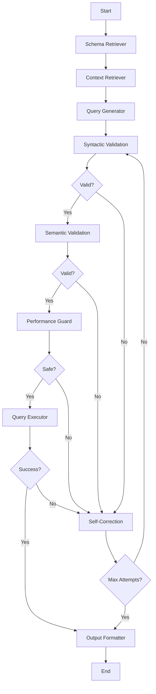

# Database Agents Module

This module implements advanced database querying agents with self-correction and validation capabilities using LangGraph workflows.

## Overview

The agents module provides sophisticated AI-powered database querying with multiple layers of validation and self-correction. The primary implementation is the **RAG Agent** which combines Retrieval-Augmented Generation with a 4-layer validation system.

## Architecture

### RAG Agent with Self-Correction

The RAG Agent implements a comprehensive workflow with the following components:

#### 4-Layer Validation System

1. **Layer 1: Syntactic Validation**
   - Uses SQLFluff and SQLGlot for SQL syntax validation
   - Checks for proper SQL grammar and structure
   - Database-specific dialect validation

2. **Layer 2: Semantic Validation**
   - Verifies that referenced tables and columns exist in the database schema
   - Cross-references AI-generated SQL against actual database structure
   - Prevents AI "hallucinations" of non-existent database objects

3. **Layer 3: AI-Powered Self-Correction**
   - Execution feedback loop with sandboxed query execution
   - Captures database error messages and feeds them back to the LLM
   - Iterative debugging and correction process
   - Maximum correction attempts to prevent infinite loops

4. **Layer 4: Performance Guardrails**
   - Automatic LIMIT clause injection for potentially large result sets
   - Query timeout enforcement
   - Detection and prevention of dangerous operations
   - Query cost estimation and optimization

### Technology Stack

- **LangGraph**: Workflow orchestration and state management
- **LiteLLM**: Multi-model LLM support (OpenAI, Anthropic, etc.)
- **LanceDB**: Embedded vector database for RAG context retrieval
- **SQLFluff**: SQL linting and syntax validation
- **SQLGlot**: SQL parsing and dialect translation
- **OpenAI Embeddings**: Text embeddings for semantic search

## Components

### Core Classes

#### `RAGAgent`
Main agent class that orchestrates the entire workflow.

```python
from agents import RAGAgent

agent = RAGAgent(
    db_connection=db_connection,
    openai_api_key="your-api-key",
    model="gpt-3.5-turbo",
    lancedb_path="./lancedb_rag"
)

result = agent.process_query(
    user_query="Show me all users with their book loans",
    database_type="postgresql",
    max_corrections=3
)
```

#### `AgentState`
TypedDict defining the complete state schema for the workflow.

### Workflow Nodes

#### Retrieval Nodes
- **`SchemaRetrieverNode`**: Extracts database schema information
- **`ContextRetrieverNode`**: Retrieves relevant context using vector similarity

#### Generation Node
- **`QueryGeneratorNode`**: Generates SQL queries using LLM with RAG context

#### Validation Nodes
- **`SyntacticValidatorNode`**: Layer 1 validation using SQLFluff/SQLGlot
- **`SemanticValidatorNode`**: Layer 2 validation against database schema

#### Execution Nodes
- **`PerformanceGuardNode`**: Layer 4 performance and safety guardrails
- **`QueryExecutorNode`**: Sandboxed query execution with timeout
- **`SelfCorrectionNode`**: Layer 3 AI-powered error correction

#### Output Node
- **`OutputFormatterNode`**: Formats final results for user presentation

## Workflow



## Features

### Self-Correction Capabilities

- **Syntax Error Recovery**: Automatically fixes SQL syntax errors
- **Schema Mismatch Correction**: Corrects references to non-existent tables/columns
- **Execution Error Handling**: Learns from database error messages
- **Performance Optimization**: Adds missing LIMIT clauses and optimizations

### Safety Measures

- **Query Timeout**: Prevents long-running queries
- **Dangerous Operation Detection**: Blocks DROP, DELETE, TRUNCATE operations
- **Resource Protection**: Prevents cartesian products and infinite loops
- **Sandboxed Execution**: Safe query execution environment

### RAG Context Retrieval

- **Vector Storage**: Uses LanceDB for efficient similarity search
- **Schema Indexing**: Automatically indexes database schema for retrieval
- **Context Chunking**: Intelligent text chunking for optimal retrieval
- **Relevance Scoring**: Retrieves most relevant context for query generation

## Usage Examples

### Basic Usage

```python
from agents import RAGAgent
from database.connection import db_connection

# Initialize agent
agent = RAGAgent(
    db_connection=db_connection,
    openai_api_key="your-openai-key"
)

# Process query
result = agent.process_query("Show me all overdue books")

if result['success']:
    print(f"SQL: {result['sql_query']}")
    print(f"Results: {result['result']}")
else:
    print(f"Error: {result['error_message']}")
```

### Advanced Configuration

```python
agent = RAGAgent(
    db_connection=db_connection,
    openai_api_key="your-openai-key",
    model="gpt-4",  # Use GPT-4 for better accuracy
    lancedb_path="./custom_vector_db",
    max_corrections=5  # Allow more correction attempts
)

# Process complex query
result = agent.process_query(
    user_query="Find users who borrowed fantasy books but haven't returned them, ordered by due date",
    database_type="postgresql",
    max_corrections=3
)
```

### Integration with Main App

The RAG Agent is integrated into the main application through the query engine factory:

```python
# In database/query_engine.py
engine = query_engine_factory.create_query_engine("rag_advanced", {
    'openai_api_key': Config.OPENAI_API_KEY
})

success, sql_query = engine.generate_query(user_query, context)
```

## LanceDB Integration

### Why LanceDB?

LanceDB is used as an embedded vector database that doesn't require Docker or external services:

- **Embedded**: Runs directly in the Python process
- **No Docker Required**: Unlike other vector databases
- **High Performance**: Optimized for similarity search
- **Persistent Storage**: Data persists between application restarts

### Vector Storage Structure

```python
# Schema context is automatically chunked and stored
{
    "id": "schema_0",
    "text": "TABLE: users\nCOLUMNS:\n- id: UUID (NOT NULL)\n- username: VARCHAR(50)...",
    "vector": [0.1, 0.2, ...],  # OpenAI embedding
    "metadata": {"type": "schema", "chunk_id": 0}
}
```

## Configuration

### Environment Variables

```bash
# Required
OPENAI_API_KEY=your-openai-api-key

# Optional
LANCEDB_PATH=./lancedb_rag
DEFAULT_MODEL=gpt-3.5-turbo
MAX_CORRECTIONS=3
QUERY_TIMEOUT=30
```

### Model Support

Thanks to LiteLLM integration, the agent supports multiple LLM providers:

```python
# OpenAI
agent = RAGAgent(model="gpt-3.5-turbo")
agent = RAGAgent(model="gpt-4")

# Anthropic
agent = RAGAgent(model="claude-3-sonnet-20240229")

# Local models
agent = RAGAgent(model="ollama/llama2")
```

## Performance Considerations

### Query Optimization

- Automatic LIMIT clause injection
- Query cost estimation
- Performance guardrails
- Timeout protection

### Vector Search Optimization

- Efficient embedding storage
- Chunked schema indexing
- Relevance-based retrieval
- Configurable search parameters

## Error Handling

### Correction Strategies

1. **Syntax Errors**: Use SQLFluff/SQLGlot feedback for precise corrections
2. **Schema Errors**: Cross-reference with actual database schema
3. **Execution Errors**: Parse database error messages for targeted fixes
4. **Performance Issues**: Apply automatic optimizations

### Fallback Mechanisms

- Maximum correction attempts
- Graceful degradation
- Detailed error reporting
- User-friendly error messages

## Monitoring and Debugging

### Logging

The agent provides comprehensive logging at different levels:

```python
import logging
logging.basicConfig(level=logging.INFO)

# Logs include:
# - Query generation steps
# - Validation results
# - Correction attempts
# - Execution metrics
```

### Metrics

Each query execution returns detailed metadata:

```python
result = agent.process_query("your query")

print(f"Execution time: {result['execution_time']}s")
print(f"Correction attempts: {result['correction_attempts']}")
print(f"Estimated cost: {result['estimated_cost']}")
```

## Future Enhancements

### Planned Features

1. **Advanced Analytics**: Query pattern analysis and optimization suggestions
2. **Multi-Database Support**: Cross-database query capabilities
3. **Custom Validation Rules**: User-defined validation and correction rules
4. **Query Caching**: Intelligent caching of successful queries
5. **Performance Profiling**: Detailed query performance analysis

### Extensibility

The modular design allows for easy extension:

- Custom validation nodes
- Additional correction strategies
- New LLM integrations
- Enhanced context retrieval methods

## Troubleshooting

### Common Issues

1. **LanceDB Initialization Errors**
   ```bash
   # Ensure directory permissions
   chmod 755 ./lancedb_rag
   ```

2. **OpenAI API Errors**
   ```bash
   # Check API key validity
   export OPENAI_API_KEY=your-valid-key
   ```

3. **SQL Validation Failures**
   ```bash
   # Install required dependencies
   pip install sqlfluff sqlglot
   ```

### Debug Mode

Enable detailed debugging:

```python
import logging
logging.getLogger('agents').setLevel(logging.DEBUG)

agent = RAGAgent(...)
result = agent.process_query("your query")
```

## Contributing

When contributing to the agents module:

1. Follow the existing node pattern
2. Add comprehensive logging
3. Include error handling
4. Write unit tests
5. Update documentation

### Adding New Nodes

```python
class CustomValidatorNode:
    def __call__(self, state: AgentState) -> AgentState:
        # Your validation logic
        state['next_action'] = 'next_node'
        return state
```

## License

This module is part of the Database Agent App and follows the same licensing terms.